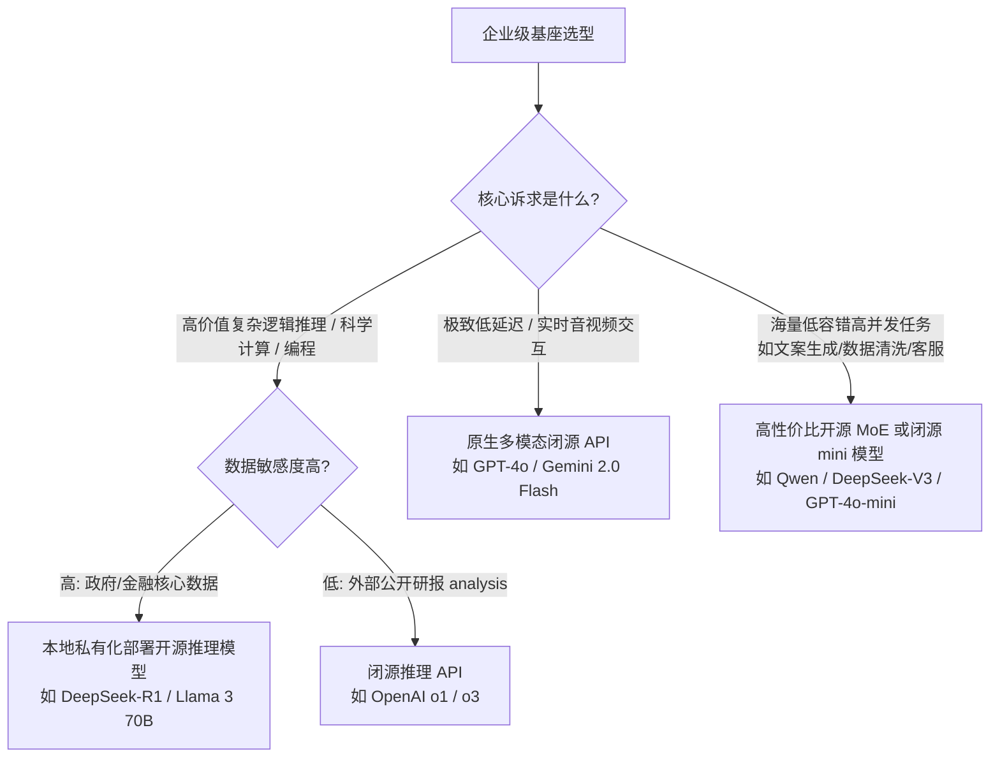

# AI PM 面试：最前沿大模型产品变迁与基座选型指南 (2026 最新版)

如果你在面试中能把“大模型底座的演进”和“产品商业化上的落地”结合起来讲，就能展现极其宏大的技术视野。不要背诵参数规模，要讲**“技术进化是如何解锁新产品形态的”**。

---

## 🚀 1. 最前沿大模型的产品变迁思路

大模型过去几年的发展，不仅仅是跑分越来越高，而是**“产品定位”**发生了四次根本性变迁：

1.  **V1 阶段：文本完形填空机（单一模态生成器）**
    *   **代表产品**：早期的 Jasper、Copy.ai。
    *   **特点**：仅仅是用来“续写文本”和“润色文章”。产品形态是左边输入框，右边输出框。
2.  **V2 阶段：具备推理能力的对话助理（Agentic 初现）**
    *   **代表产品**：ChatGPT (GPT-3.5/4 时代)、初期 Claude。
    *   **特点**：加入了 RLHF（人类反馈强化学习），模型开始“听指令”，演化出了 Function Calling 和逻辑推理能力。此时的大模型不再是一个生成器，而是**“中央处理大脑”**，可以外接 API、读写数据库。
3.  **V3 阶段：原生多模态与超长上下文操作系统**
    *   **代表产品**：GPT-4o、Gemini 1.5 Pro / 2.0。
    *   **特点**：
        1.  **原生多模态**：端到端的声学/视觉处理，不再是“语音转文字，文字算完生文字，文字转语音”的拼凑延迟。
        2.  **百万 Context**：使得模型从“回答单薄问题”变成了能直接“阅读一整座图书馆并在里面大海捞针”。大模型正试图取代传统的搜索引擎和本地 RAG 架构。
4.  **V4 阶段：慢思考推理模型与具身自主 Agent (2025-2026年现状)**
    *   **代表产品**：OpenAI o1/o3、DeepSeek-R1、Claude 3.5 Computer Use / Operator。
    *   **特点**：
        1.  **System 2 慢思考**：通过大规模强化学习（RL）训练思维链（CoT），在输出最终答案前进行自主试错、验证与纠错，彻底攻克了复杂代码、高等数学和精细逻辑推理的幻觉瓶颈。
        2.  **视觉行动器 (UI-Directed Agent)**：不仅能输出文字，还能直接接管屏幕、模拟键盘鼠标操作复杂软件（如网页浏览器、IDE、办公软件），实现了“从 Chat 到 Action”的跨越。

**【面试金句】**：“大模型正在从一个『外包写手』演进为具备慢思考决策能力的『中央操作系统(OS)』与『虚拟员工』。”

---

## 🧬 2. 大模型升级的底层逻辑及如何迁移到自己的产品？

考官最爱问：“你了解 GPT 及前沿大模型是怎么一步步升级的吗？这给你做产品带来了什么启发？”

| 模型版本 / 技术节点 | 核心技术改变 (What) | 给 AI PM 的产品迁移启示 (How) |
| :--- | :--- | :--- |
| **GPT-1/2** | 无监督预训练（预测下一个词）。只会续写。 | **启示**：不要强迫早期模型做逻辑回答，只能做灵感发散（如写作起草工具）。 |
| **GPT-3 / 3.5** | 参数涌现与人类反馈强化学习 (RLHF)。把野兽驯化成了听指令的助手。 | **启示**：开启了 **Prompt Engineering** 时代，且“对齐比聪明更重要”。在做企业级 Agent 时，必须有黄金数据集（Golden Dataset）进行语气和安全性对齐。 |
| **GPT-4** | 参数飞升（MoE 架构）；极度增强的逻辑推理 (Reasoning)。 | **启示**：解锁了 **Agent (智能体)** 赛道。在复杂的业务流里（如帮客户退费），敢把控制权交给 GPT-4做路由分发了。 |
| **GPT-4o / Gemini 2.0** | **原生 (Native) 端到端多模态**。直接切实时音视频流，延迟降至二三百毫秒。 | **启示**：颠覆了传统文字交互界面！所有的客服、陪伴应用，必须拥抱实时双工的语音/视频交互，真正做到“拟人化”。 |
| **OpenAI o1/o3 & DeepSeek-R1** | **强化学习强化思维链 (CoT)**。将计算资源从训练侧转移到推理侧（Inference-time Compute）。 | **启示**：**产品形态从“实时秒回”走向“高价值异步决策”**。交互设计上需要考虑“思考过程的可视化”和“异步进度反馈”，且为“思考质量”付费而非字数。 |
| **DeepSeek 带来的极低成本革命** | 算法架构优化（MLA、DeepSeekMoE、Multi-token Prediction）使得推理成本下降 95% 以上。 | **启示**：**重度 Agent 任务在商业上真正闭环**。原先因 Token 消耗过贵而无法落地的多智能体协同、自动化代码重构、全网深度研报生成，现在能以极低成本普惠化。 |

---

## 🔮 3. 2026 前沿技术趋势与产品落地的“核心猜想”

面试官问：“你觉得大模型接下来的技术与产品演进会往哪里走？”

不要回答“参数更大”，这太空泛。要从**商业落地**和**产品交互**两方面讲：

1.  **猜想 1：从“基于文字的 Agent”转向“系统级 Computer Use 虚拟员工”**
    *   未来的升级版大模型会标配屏幕理解与操作能力。
    *   **产品形态**：无需为每个软件单独开发 API 插件，模型直接看屏幕、点按钮、填表单。AI PM 应该设计“人类监督（Human-in-the-loop）”的安全控制机制，而非开发繁琐的后门接口。
2.  **猜想 2：长上下文（Gemini-style）对 RAG 架构的颠覆与融合**
    *   百万级、千万级上下文的低延迟化，使得 80% 的常规企业文档可以直接塞入 Context 窗口，传统分块（Chunking）与向量检索（Embedding）的 RAG 方案在很多场景将退化为辅助。
    *   **产品设计**：重心从“数据清洗与切片”转向“全局语义关联的提示词工程”。
3.  **猜想 3：推理算力（Inference-time Compute）的按需分配与动态定价**
    *   大模型将提供“思考时间”滑块。简单问题 0.1 秒回答（便宜）；复杂科学计算/金融估值模型允许其思考 10 分钟（贵）。
    *   **商业模式**：AI 产品将从统一订阅费/按 Token 计费，演进为**“按解决问题的难度和消耗的思考算力”定价**。

---

## ⚖️ 4. 2026 闭源模型 vs 开源模型的优势与选型逻辑

这是 AI 架构的核心决断力。以 GPT/Claude (闭源旗舰) 与 DeepSeek/Llama (开源/开放权重代表) 为例，2026 年的选型逻辑已经发生了根本性重塑。

### (1) 选型维度的重新定义：
1.  **逻辑推理能力的平权**：DeepSeek-R1 的开源证明了在数学、代码和深度推理上，开源/开放权重模型已经能与最顶级的闭源模型（GPT-4o、Claude 3.5 Sonnet）平起平坐，甚至在部分指标上超越。
2.  **闭源模型的护城河转移**：闭源模型的绝对优势不再是单点的“逻辑推理”，而是转为**全球多地域的超大规模算力保障（SLA）、极低延迟的原生音视频多模态流媒体服务、以及开箱即用的极致易用性**。

### (2) AI PM 的企业级基座选型决策树 (2026 版)：

面试时，抛出这套你在业务中使用的**三维选型决策逻辑**：

*   **维度一：按任务的“思考深度”与“数据隐私”切分**
    *   如果是**写医疗诊断建议、法律合同审查、以及复杂的金融量化逻辑开发**：
        *   若**数据敏感度极高**（金融、国企、军工），**必须本地私有化部署开源推理模型（如 DeepSeek-R1、Llama 70B）**。现在的开源模型已具备顶尖推理能力，企业无需再因性能妥协而冒险将敏感数据上传公有云。
        *   若**允许公有云接入**，则优先使用 **OpenAI o1/o3 或 Claude 3.5 Sonnet** 的 API，省去高昂的硬件运维成本。
*   **维度二：按任务的“交互媒介”切分**
    *   如果是**音视频实时交互、高帧率视觉监控、超低延迟的端到端对话**：**必须选择闭源多模态旗舰（GPT-4o 或 Gemini 2.0 Flash）**。开源模型目前在端到端原生音视频处理上的推理基建和低延迟分发网络，依然大幅落后于科技巨头。
*   **维度三：按时延与并发要求切分 (Latency & Cost)**
    *   如果是**每秒上千并发的电商大促客服、海量非敏感文本的清洗、小红书批量文案生成**：**全面使用性价比极高的开源 MoE 模型（如 DeepSeek-V3）或闭源迷你模型（GPT-4o-mini）**。通过成本只有旗舰模型十几分之一的模型，在保障基本效果的同时实现完美的商业 ROI。

**总结**：“在 2026 年，卓越的 AI PM 不会迷信任何一家模型，而是设计 **混合模型路由架构 (Model Routing)**。根据任务的敏感度、算力消耗、交互时延，让 DeepSeek 负责高逻辑私有推理，让 GPT/Gemini 承接低延迟多模态实时交互，用 Mini 模型处理海量脏活累活。在成本、安全和性能间踩准平衡，才是 AI PM 架构设计的核心功力。”

---
此选型与演进分析指南已收录至面试库：`d:\PromptX-main\worldbrain\AI_PM_Interview_Pack\model_evolution_and_selection.md`。
