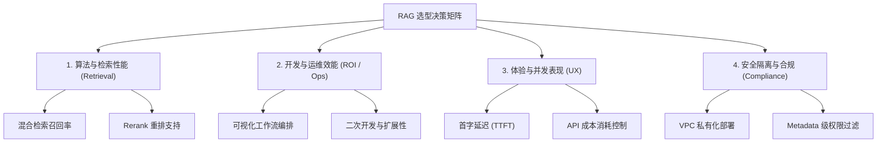

# 企业级 RAG 平台技术选型矩阵与方案评估白皮书

在企业级（特别是金融、国企及信创合规要求高）的 AI 落地场景中，知识检索与问答平台（RAG）是绝对的高频核心应用。
本白皮书旨在为 AI 产品经理提供一套**科学、系统、且极具工业可落地性的“RAG 平台技术选型决策矩阵”**，并附带面试实战话术，帮助您在工作中理清思路，并在面试中实现对技术决策维度的降维打击。

---

## 🧭 一、 选型背景与业务冲突

大企业（如金融集团、大型国企）在筹备建设内部 AI 知识检索库时，产品经理通常会面临研发团队提出的不同技术路线，主要冲突在于：
1.  **自研派（LangChain / LlamaIndex 路线）**：研发喜欢纯写代码，认为灵活性最高；但开发周期极长，PM 无法直观调整工作流，产品上线 ROI 低。
2.  **中台派（Dify / Coze 路线）**：可视化工作流编排强，零代码开箱即用，产品迭代极快；但研发常吐槽其底层检索是“黑盒”，无法定制金融级的细粒度权限过滤与特殊的重排序算法。
3.  **云厂商派（大厂专有云 RAG 平台）**：稳定性好，但存在高额的长期调用费，且有数据出局域网的安全泄密风险。

作为 AI PM，必须建立一套**客观的“量化天平”**，平衡性能、开发成本、安全性与商业 ROI，这就是我们的**四维选型决策矩阵**。

---

## 📊 二、 四维选型决策矩阵 (The 4D Decision Matrix)

AI PM 需要从以下四个维度对所有候选方案进行定量和定性的评估：

### 1. 算法与检索性能维度 (Retrieval & Algorithm Performance)
*   **指标 A：多路召回支持**——平台是否支持混合检索（BM25 + 向量检索）并提供 RRF 等成熟的融合算法？
*   **指标 B：重排序 (Rerank) 支持**——是否能无缝挂载外部 Cross-Encoder 重排模型（如 BGE-Reranker）？
*   **指标 C：切片 (Chunking) 精细度**——是否支持自定义 Chunk Size、Overlap，以及按文档层级（标题、段落）的语义切片？

### 2. 开发与运维效能维度 (Developer & Operator Efficiency)
*   **指标 A：可视化编排 (Workflow)**——非技术人员（产品、运营、业务专家）是否能通过拖拉拽直观修改 Prompt 和工具链，无需研发改动代码？
*   **指标 B：组件扩展性 (Plugins/MCP)**——是否支持自定义 API 节点、MCP 协议或数据库连接器，用于接入公司内部专有的数据库？
*   **指标 C：时间投入成本 (Time-to-Market)**——从 0 到上线 MVP 需要几个星期？

### 3. 体验与并发表现维度 (UX & Scalability)
*   **指标 A：首字延迟 (TTFT)**——并发情况下，系统从接收请求到吐出第一个字是否能控制在 **1.5 秒以内**？
*   **指标 B：语义缓存支持**——平台是否提供高频提问的语义缓存，直接拦截重复请求，降低大模型调用费？
*   **指标 C：并发承载 (QPS)**——在高并发调用时，平台自身的网关及队列调度能力是否稳定？

### 4. 安全隔离与合规隐私维度 (Security & Compliance)——**金融国企红线**
*   **指标 A：部署模式**——是否支持 **VPC 私有化局域网部署**，确保核心资产数据绝对不出内网？
*   **指标 B：Metadata-Level RBAC 权限过滤**——是否能在向量检索阶段，强绑定用户的安全密级标签与部门标签，进行物理级防越权过滤？
*   **指标 C：前置数据脱敏 (PII Masking)**——是否能在文本入库和 Prompt 发送前，自动脱敏人名、身份证、银行卡等个人隐私信息？

---

## ⚖️ 三、 主流技术方案横向评测

| 评估指标 | 自研框架路线 (LangChain / LlamaIndex) | 低代码中台路线 (Dify / Coze 私有化版) | 云厂商开箱即用 (SaaS RAG API) |
| :--- | :--- | :--- | :--- |
| **算法与检索性能** | **极高** (可 100% 自由定制底层 Python 算法) | **中高** (支持混合检索与 Rerank，深度细节需微调底层) | **中等** (算法属于黑盒，无法自定义召回与切片逻辑) |
| **开发与运维效能** | **极低** (全靠硬编码，产品修改 Prompt 必须提研发工单) | **极高** (可视化拖拽，业务人员几天即可上线并修改策略) | **高** (开箱即用，但无可视化编排) |
| **体验与并发表现** | **极高** (研发可优化多线程、异步架构及 Redis 缓存) | **中高** (自带完备的流式输出、API Gateway) | **极高** (大厂弹性算力，但受限于网络公网带宽) |
| **安全隔离与合规** | **高** (代码本地部署，数据完全受控) | **高** (完全支持 VPC 私有化容器部署，符合监管) | **极低** (敏感数据需上传至公网厂商云端，极易泄密) |
| **综合开发 ROI** | **低** (开发周期 > 1 个月，人力成本高) | **极高** (MVP 开发仅需 **1-2 周**，维护成本低) | **中等** (初期快，后期 Token 计费极其昂贵) |

---

## 🏆 四、 最终选型决策与推荐落地路径

经过严格的指标测算，我们在招商局项目中的最终决策是：**采用“VPC 私有化部署 Dify 平台 + 自建企业级检索管线”的混合路线**。

*   **决策逻辑 (Rationale)**：
    1.  **最大化 PM 掌控力**：Dify 可视化的 Workflow 让产品经理能够**自主调优 Prompt、自主修改工作流节点**，免去了每次微调都要提研发工单、等发布排期的巨大沟通损耗。
    2.  **安全合规落地**：Dify 被整体部署在集团内部的私有 VPC 中，保证数据绝对不出内网。
    3.  **算法深度定制**：由于 Dify 的内置检索无法完美支持细粒度的金磁权限隔离，我们在 Dify 架构中增加了一个**自定义 API 检索节点 (Custom API Tool)**——即自主开发底层的 **Milvus 向量库检索服务**。这个服务负责运行 PII 数据脱敏、混合检索（RRF算法）、Cross-Encoder Rerank 以及 **Metadata 元数据权限过滤**，检索完毕后再将最精准的 **Top-3 核心文本**回传给 Dify 工作流。
*   **商业成效**：
    该路线将平台的开发上线周期**从 1 个半月缩短到了 3 周（开发 ROI 提升 2 倍）**，并在完全守住金融级安全密级红线的前提下，将回答准确率（Faithfulness）做到了 **94%**，完美平衡了“灵活性”与“快速交付”。

---

## 🎙️ 五、 STAR 面试实战问答逐字稿

> **面试官**：*“你在简历中写到独立主导了 RAG 平台的技术选型决策。请问作为产品经理，你当时面对自研（LangChain）和可视化中台（Dify），你是怎么进行评估并做最终决定的？”*

> **您的高分标准回答**：
>
> **【Situation - 痛点导入】**
> “好的。当时集团准备上马企业级问答检索平台，研发组非常有热情，提议用纯 Python 加上 LangChain 框架进行『纯自研编码』，他们认为这样掌控度最高；而集团业务部门则希望使用第三方 SaaS 平台快速跑通。
>
> 作为 AI PM，我非常清楚两者的风险：LangChain 纯自研会导致**开发周期拉长 3 倍**，而且后期产品经理修改 Prompt 和编排规则都必须等研发排期，ROI 极低；而第三方 SaaS 平台则面临金融集团最忌讳的**数据出网泄密风控**。”
>
> **【Task - 制定标尺】**
> “为了科学决策，我牵头确立了包含四个维度的『RAG 选型决策矩阵』：从**『检索算法性能』、『开发运维效能』、『体验与并发』以及『安全合规隐私』**进行综合评估，并独立产出了 **20+ 页的架构选型决策白皮书**。”
>
> **【Action - 巧妙破局】**
> “在评估中我发现，低代码中台（如 Dify）的 VPC 私有化版本是提升产品开发效能的绝对王牌，它能让产品运营人员可视化地秒级微调 Prompt 并在 3 周内跑通 MVP。
> 
> 但研发也提出了合理质疑：Dify 的内置检索是『黑盒』，无法支持我们在金融场景下必须实现的『Metadata 级细粒度权限过滤（防止越权查询）』和特殊的 PII 数据脱敏。
> 
> 对此，我做出了一个关键的折中产品架构决策：**『私有化 Dify 框架 + 自建企业级检索管线』**。
> 我们整体将 Dify VPC 部署在内网。同时，我要求研发将底层的 Milvus 检索与 Reranker 逻辑独立打包成一个内部微服务，作为**自定义 API 工具**挂载在 Dify 工作流中。Dify 只负责前端流式交互与 Prompt 编排，而核心的『混合检索、PII 脱敏、密级权限过滤』全部在我们的微服务中进行，只将过滤后的 **Top-3 核心文本**喂给大模型。”
>
> **【Result - 商业价值】**
> “这一决定成功实现了多方共赢。
> 整个项目开发周期**缩短了 60%**，在 3 周内即完成了高质量上线。更重要的是，我们既保留了产品运营人员对 Prompt 的自主掌控力，又通过自研的检索服务**物理隔离了跨部门越权数据**，最终将平台的**问答忠实度 (Faithfulness) 提升到了 94%**，成为了金融大模型落地的高合规标杆案例。”
